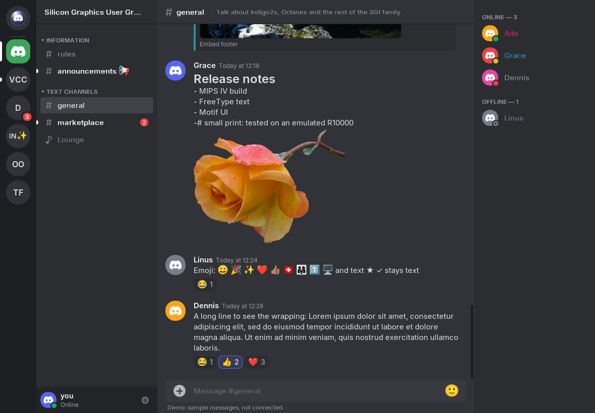
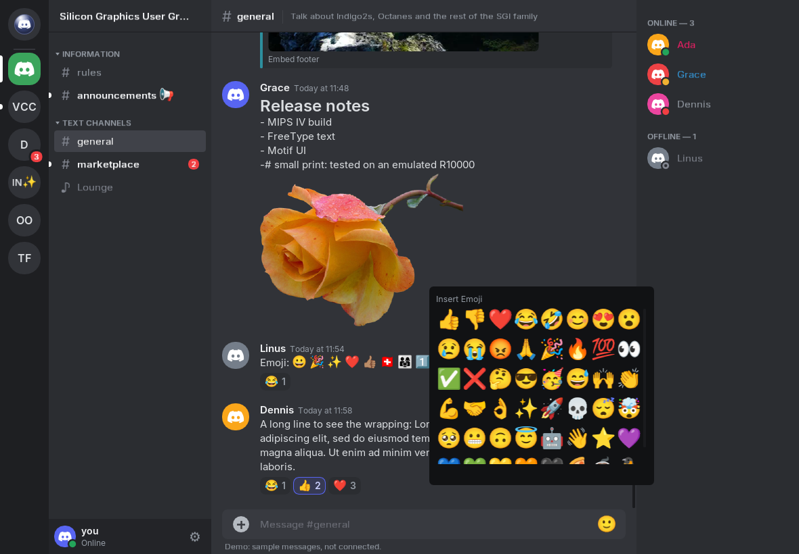
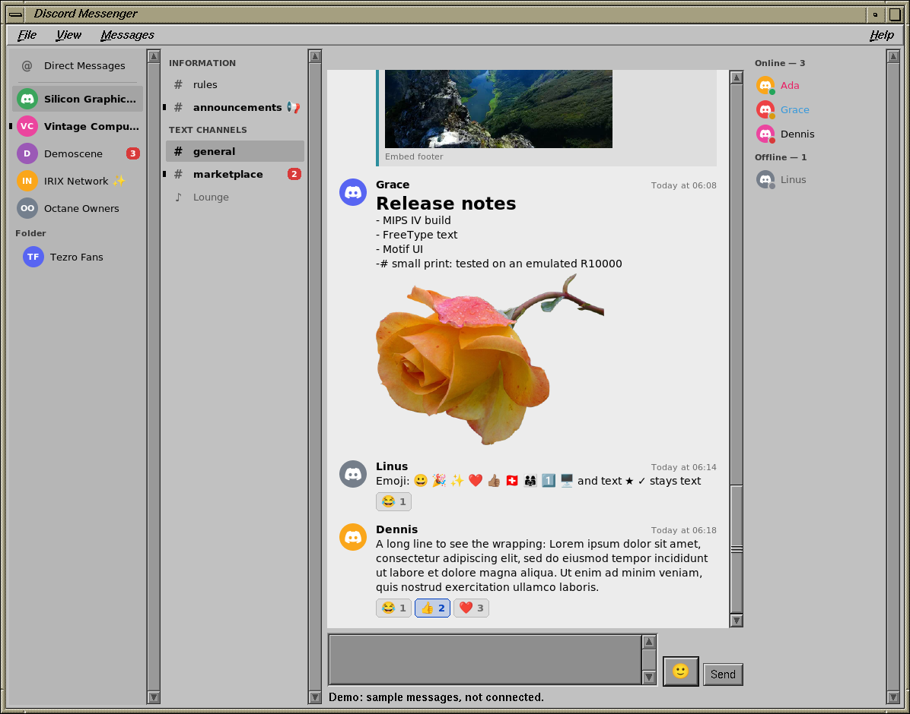
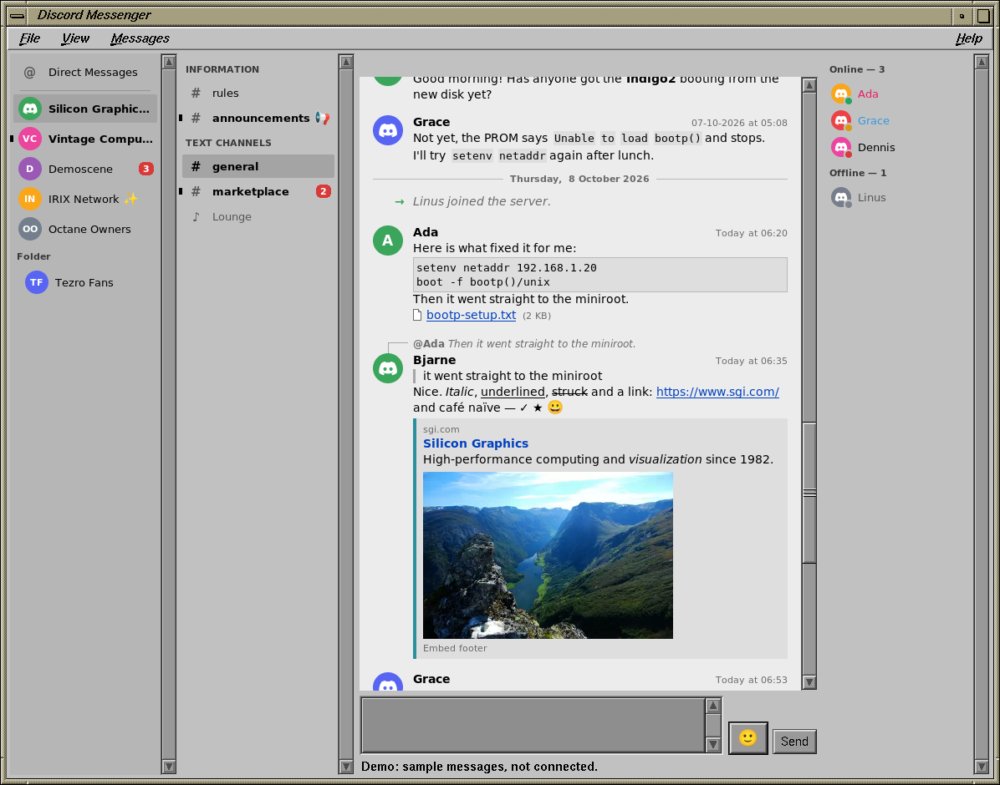

# Discord Messenger

Discord Messenger is a messenger application designed to be compatible with Discord. It runs on
several platforms, with a user interface that suits each:

- **IRIX** (SGI's IRIX 6.5): a Motif client that follows your desktop's colour scheme. Motif is
  also the way to other classic Unix systems.
- **macOS**, **Linux** and **Windows** (x64 and ARM64): a client in the style of Discord's own,
  drawn with [Dear ImGui](https://github.com/ocornut/imgui) on GLFW and OpenGL.

All of them share one core: the connection to Discord, the message formatting, the image and
history cache, and the text and emoji rendering.

It started as a fork of [Discord Messenger](https://github.com/DiscordMessenger/dm) by iProgramInCpp
and its contributors.

**NOTE**: This is beta software, so there may be issues which need to be fixed!

The project is licensed under the MIT license.

## Disclaimer

Using third party clients is against Discord's TOS! Although the risk to get banned is low, the
risk is there! The author of this software is not responsible for the status of your Discord
account.

See https://twitter.com/discord/status/1229357198918197248.

## Screenshots









## Minimum System Requirements

### IRIX

- IRIX 6.5.22 or later, with X11 and IRIX's Motif (`x_eoe`, `motif_eoe`)

- Any MIPS CPU from the R4000 on (the program is built for MIPS III): R4400, R4600, R5000, R8000,
  R10000 and later

- 128 MB of RAM: the client keeps about 50 MB resident on a busy server

- About 25 MB of disk for the program, its fonts and certificates, plus up to the size you allow for
  the image and message cache in `~/.discordmessenger/cache`

- Any graphics board: true-colour visuals are used as they are, 8-bit ones through a colour cube

- A network connection with working DNS; everything goes over HTTPS and secure websockets

Nothing else is needed: OpenSSL, FreeType, libpng, zlib, bzip2, libwebp and libc++ are linked into
the program, and the package brings its own fonts (DejaVu, Noto Color Emoji) and root certificates.

### macOS

- A Mac with Apple Silicon
- The macOS version the app was built on, or later (the build records its SDK's version as the
  minimum)
- OpenGL is the system's own; OpenSSL, libwebp, FreeType, libpng and GLFW are linked into the app,
  which also brings its fonts (Inter, DejaVu, Noto Color Emoji)

### Linux

- X11 or Wayland, with OpenGL 3.0 or later
- OpenSSL 3, libwebp, FreeType and GLFW 3 (the distribution's packages)

### Windows

- Windows 10 (version 1903 or later) or Windows 11, x64 or ARM64
- OpenGL 3.0 or later. ARM64 PCs whose graphics driver has no OpenGL need Microsoft's "OpenCL,
  OpenGL and Vulkan Compatibility Pack" from the Microsoft Store
- Nothing else: OpenSSL, FreeType, libpng, zlib, libwebp, GLFW and the C runtime are linked in, and
  the fonts come in the zip. Server certificates are checked by Windows, against its own
  certificate stores
- For logging in on discord.com's page and Discord's captcha: Microsoft's Edge WebView2 runtime,
  which Windows 11 and current Windows 10 have (without it, the QR code and the token remain)

## Installing

### IRIX

Download the newest `.tardist` from the [releases](https://github.com/atomchild411/dm/releases) and
open it with Software Manager (swmgr), or:

```
mkdir /usr/tmp/dm && cd /usr/tmp/dm && tar xf dmessenger-<version>.tardist
inst -f /usr/tmp/dm -a
```

It upgrades any earlier release in place. Then run `/usr/local/bin/discord-messenger`.
Its README, installed as `/usr/local/lib/discord-messenger/README` (`irix/dist/README` here),
describes logging in, every feature and the environment variables it reads.

### macOS, Linux and Windows

There are no releases yet: build the client as below. On macOS that gives you
`bin/Discord Messenger.app`, which you can copy to `/Applications`; on Windows a zip to unpack
anywhere, with `DiscordMessenger.exe` and its `fonts` folder.

## Building

After cloning, check out the submodules with `git submodule update --init`. The top of the
`Makefile` lists every setting; `FRONTEND` picks the client: `motif`, `imgui` or `cli`.

### IRIX

The client is cross-compiled on Linux and packaged on IRIX.

You need:

- a clang that targets IRIX 6.5 n32 (`mipseb-sgi-irix6.5`). The LLVM 21 port behind the
  `lang/clang-irix` package of [our pkgsrc fork](https://github.com/atomchild411/pkgsrc/tree/irix)
  does.
- IRIX's own X11 and Motif headers and libraries (`/usr/include`, `/usr/lib32`), copied from an
  IRIX system.
- OpenSSL 3, FreeType, libpng, zlib, bzip2 and libwebp built for IRIX, as static libraries, under
  one prefix.

After cloning, check out the submodules with `git submodule update --init`. Then:

```
make FRONTEND=motif STATIC_DEPS=1 \
    CXX=mipseb-sgi-irix6.5-clang++ CC=mipseb-sgi-irix6.5-clang \
    PREFIX_DEPS=<prefix> X_CFLAGS=-I<irix>/usr/include \
    X_LIBS='-L<irix>/usr/lib32 -lSgm -lXm -lXt -lX11 -lXext' \
    FT_LIBS='<prefix>/lib/libfreetype.a <prefix>/lib/libpng16.a <prefix>/lib/libz.a <prefix>/lib/libbz2.a' \
    EXTRA_CXXFLAGS='-march=mips3 -DDM_DATADIR=\"/usr/local/lib/discord-messenger\"' \
    EXTRA_LDFLAGS='-march=mips3 -static-libstdc++'
```

The program is `bin/dm-motif`. `FRONTEND=cli` builds `dm-cli`, a text client that drives the same
core without a GUI, for testing a port (`dm-cli --probe` checks HTTPS, TLS and the gateway without
logging in). The top of the `Makefile` lists every setting.

To make the package, copy the program and the `irix/dist` directory to an IRIX machine and run
`irix/dist/make-tardist.sh` there; it uses IRIX's `gendist`. The script's comments give its
arguments.

### macOS

With [Homebrew](https://brew.sh): `brew install openssl@3 webp freetype libpng glfw`. Then put the
fonts in one directory: Inter 4 (`Inter-Regular.ttf`, `Inter-SemiBold.ttf`, `Inter-Italic.ttf`,
`Inter-SemiBoldItalic.ttf` and `Inter-LICENSE.txt`, from [rsms.me/inter](https://rsms.me/inter/)),
DejaVu (`DejaVuSans*.ttf`, `DejaVuSansMono*.ttf`) and `NotoColorEmoji.ttf`, and run:

```
macos/make-app.sh <fonts directory>
```

It builds `bin/Discord Messenger.app`, with the libraries linked in, signed ad hoc. For a quick
build to run from the source tree instead:

```
make FRONTEND=imgui PREFIX_DEPS=/opt/homebrew FT_CFLAGS=-I/opt/homebrew/include/freetype2 \
    CXX=clang++ CC=clang
DM_FONT_DIR=<fonts directory> bin/dm-imgui
```

### Linux

On Debian or Ubuntu:

```
apt install g++ make pkg-config libssl-dev libwebp-dev libfreetype-dev libglfw3-dev libgl-dev \
    fonts-dejavu-core fonts-dejavu-extra fonts-noto-color-emoji
make FRONTEND=imgui PREFIX_DEPS=/usr FT_CFLAGS=-I/usr/include/freetype2
```

The program is `bin/dm-imgui`. `DM_FONT_DIR` names a directory with the fonts (as for macOS); without
Inter it uses DejaVu Sans.

### Windows

Windows builds are cross-compiled, on Linux (WSL2 included) or macOS, in a container (podman or
docker): clang for Microsoft's ABI, and Microsoft's Windows SDK and C runtime, which
[xwin](https://github.com/Jake-Shadle/xwin) downloads. No Visual Studio, MinGW or MSYS2 is involved.
With the fonts in a directory as for macOS:

```
windows/build.sh --accept-license --fonts <fonts directory>
```

`--accept-license` accepts [Microsoft's licence](https://go.microsoft.com/fwlink/?LinkId=2086102)
for the SDK and C runtime, which the first build downloads. The script fetches OpenSSL, FreeType,
libpng, zlib, libwebp, GLFW and the WebView2 SDK too, checks each against its SHA-256, and builds them once. It
leaves `bin/windows/DiscordMessenger-<version>-windows-x64.zip` and `-arm64.zip`. The top of
`windows/build.sh` has the details; `windows/inside.sh` is what runs in the container.

### Any platform

`FRONTEND=cli` builds `dm-cli`, a text client that drives the same core without a GUI, for testing
a port (`dm-cli --probe` checks HTTPS, TLS and the gateway without logging in). `--demo` starts any
client with sample servers and messages, without connecting.

## Features

### Implemented

- Logging in with a QR code scanned by the Discord app, or with a token; on macOS and Windows also
  on discord.com's own page (email and password), in a window of the app
- Discord's captcha, which it sometimes asks for at the end of a QR login: on macOS and Windows it
  shows in a window of its own
- Server certificates checked by the system on macOS and Windows (its own roots, revocation and
  any certificates your organisation added), and against the distribution's or our bundled roots
  on Linux and IRIX
- Servers (with their icons and folders), channels, the member list and direct messages
- Messages with Discord's formatting, replies, reactions, embeds and colour emoji
- Pictures in messages, and a viewer that scales them with its window
- Sending, replying, editing and deleting messages; emoji by shortcode or from a picker, the
  server's own emoji included
- Adding and taking back reactions
- Who is typing
- Read marks kept in step with Discord's other clients
- Coming back to the server and channel you were last in
- A cache of images and message history on disk, with size limits
- IRIX: a sound for mentions and direct messages, unread counts in the window's icon name, and the
  Messages menu, listing direct messages with the unread ones first, each conversation in a window
  of its own; showing or hiding the server, channel and member lists, larger or smaller text
- macOS, Linux and Windows: the layout of Discord's own client, and a bar to jump back to the
  newest messages when you have scrolled up

### Unimplemented

- Uploading attachments
- Voice channels
- Friends list
- IRIX: typing non-Latin-1 text in the message box (emoji are written as shortcodes)
- IRIX and Linux: Discord's captcha (log in with a token when it asks for one)

## Attributions

Discord Messenger is powered by the following external libraries:

- [JSON for Modern C++](https://github.com/nlohmann/json)
- [Boost](https://www.boost.org)
- [Libwebp](https://github.com/webmproject/libwebp)
- [Httplib](https://github.com/yhirose/cpp-httplib)
- [Asio](https://think-async.com/Asio)
- [Websocketpp](https://github.com/zaphoyd/websocketpp)
- [OpenSSL](https://www.openssl.org)
- [FreeType](https://freetype.org), [libpng](http://www.libpng.org), [zlib](https://zlib.net) and
  [bzip2](https://sourceware.org/bzip2/)
- [stb_image](https://github.com/nothings/stb)
- [QR Code generator](https://github.com/nayuki/QR-Code-generator)
- [Dear ImGui](https://github.com/ocornut/imgui) and [GLFW](https://www.glfw.org)
- On Windows, the loader from Microsoft's [WebView2 SDK](https://developer.microsoft.com/microsoft-edge/webview2/)
- [LLVM libc++](https://libcxx.llvm.org)
- The [Inter](https://rsms.me/inter/), [DejaVu](https://dejavu-fonts.github.io) and
  [Noto Color Emoji](https://github.com/googlefonts/noto-emoji) fonts, and Mozilla's root
  certificates

Their licences come with the IRIX package, in `/usr/local/lib/discord-messenger/licenses`, with
the macOS app, in `Contents/Resources/licenses`, and in the Windows zip's `licenses` folder.
